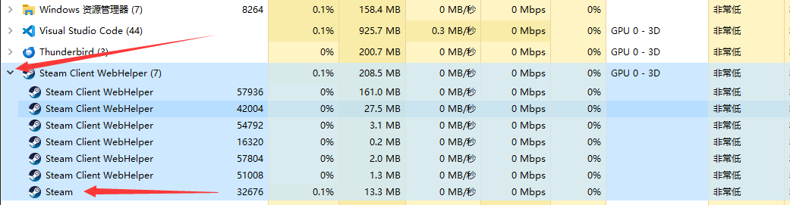

# BanProcess
 在指定时间段禁止选定程序执行
# 使用说明
 在banlist.config里添加你需要禁用的程序和时间
 
 启动后会在任务栏多出一个图标如下

 

 鼠标移动上去可以看到当前的配置，如下：

 

 右键点击任务栏图标可以退出程序。

 警告：开机自启无效，请不要打开这个选项

 程序名称是进程名，你可以在任务管理器里通过以下步骤找到：
 1. 打开任务管理器
 2. 点击你需要禁用的程序左侧的小箭头，示例如下：
    
 3. 右键点击，并点击“转到详细信息”
 4. 在详细信息里选择同名的程序，示例如下：
    
 5. 将这个进程的名字放进banlist.config，如果名字很长的话，也可以右键点击后选择属性，然后复制名称即可
